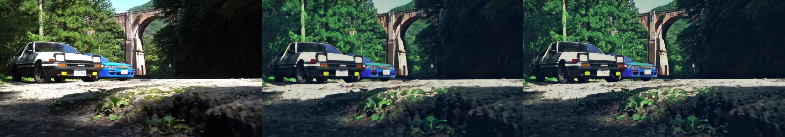
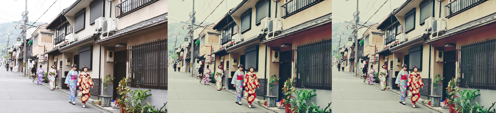
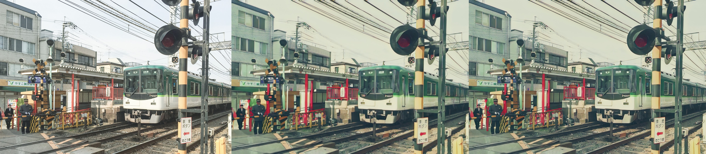

## PyTorch Implementation of [AnimeGANv2](https://github.com/TachibanaYoshino/AnimeGANv2)


**Updates**

* `2021-10-17` Add weights for [FacePortraitV2](#additional-model-weights). [](https://colab.research.google.com/github/bryandlee/animegan2-pytorch/blob/main/colab_demo.ipynb)

    

* `2021-11-07` Thanks to [ak92501](https://twitter.com/ak92501), a [web demo](https://huggingface.co/spaces/akhaliq/AnimeGANv2) is integrated to [Huggingface Spaces](https://huggingface.co/spaces) with [Gradio](https://github.com/gradio-app/gradio). [](https://huggingface.co/spaces/akhaliq/AnimeGANv2)

* `2021-11-07` Thanks to [xhlulu](https://github.com/xhlulu), the `torch.hub` model is now available. See [Torch Hub Usage](#torch-hub-usage).
 
 
## Basic Usage

**Inference**
```
python test.py --input_dir [image_folder_path] --device [cpu/cuda]
```


## Torch Hub Usage

You can load the model via `torch.hub`:

```python
import torch
model = torch.hub.load("bryandlee/animegan2-pytorch", "generator").eval()
out = model(img_tensor)  # BCHW tensor
```

Currently, the following `pretrained` shorthands are available:
```python
model = torch.hub.load("bryandlee/animegan2-pytorch:main", "generator", pretrained="celeba_distill")
model = torch.hub.load("bryandlee/animegan2-pytorch:main", "generator", pretrained="face_paint_512_v1")
model = torch.hub.load("bryandlee/animegan2-pytorch:main", "generator", pretrained="face_paint_512_v2")
model = torch.hub.load("bryandlee/animegan2-pytorch:main", "generator", pretrained="paprika")
```

You can also load the `face2paint` util function:
```python
from PIL import Image

face2paint = torch.hub.load("bryandlee/animegan2-pytorch:main", "face2paint", size=512)

img = Image.open(...).convert("RGB")
out = face2paint(model, img)
```
More details about `torch.hub` is in [the torch docs](https://pytorch.org/docs/stable/hub.html)


## Weight Conversion from the Original Repo (Tensorflow)
1. Install the [original repo's dependencies](https://github.com/TachibanaYoshino/AnimeGANv2#requirements): python 3.6, tensorflow 1.15.0-gpu
2. Install torch >= 1.7.1
3. Clone the original repo & run
```
git clone https://github.com/TachibanaYoshino/AnimeGANv2
python convert_weights.py
```

<details>
<summary>samples</summary>

<br>
Results from converted `Paprika` style model (input image, original tensorflow result, pytorch result from left to right)

 &nbsp; 
 &nbsp; 
 &nbsp; 
   
</details>
 
**Note:** Results from converted weights slightly different due to the [bilinear upsample issue](https://github.com/pytorch/pytorch/issues/10604)


## Additional Model Weights

**Webtoon Face** [[ckpt]](https://drive.google.com/file/d/10T6F3-_RFOCJn6lMb-6mRmcISuYWJXGc)

<details>
<summary>samples</summary>

Trained on <b>256x256</b> face images. Distilled from [webtoon face model](https://github.com/bryandlee/naver-webtoon-faces/blob/master/README.md#face2webtoon) with L2 + VGG + GAN Loss and CelebA-HQ images.

 &nbsp; 
  
</details>


**Face Portrait v1** [[ckpt]](https://drive.google.com/file/d/1WK5Mdt6mwlcsqCZMHkCUSDJxN1UyFi0-)

<details>
<summary>samples</summary>

Trained on <b>512x512</b> face images.

[](https://colab.research.google.com/drive/1jCqcKekdtKzW7cxiw_bjbbfLsPh-dEds?usp=sharing)
  


[📺](https://youtu.be/CbMfI-HNCzw?t=317)
  


</details>


**Face Portrait v2** [[ckpt]](https://drive.google.com/uc?id=18H3iK09_d54qEDoWIc82SyWB2xun4gjU)

<details>
<summary>samples</summary>

Trained on <b>512x512</b> face images. Compared to v1, `🔻beautify` `🔺robustness` 

[](https://colab.research.google.com/drive/1jCqcKekdtKzW7cxiw_bjbbfLsPh-dEds?usp=sharing)
  


🦑 🎮 🔥
  


</details>


