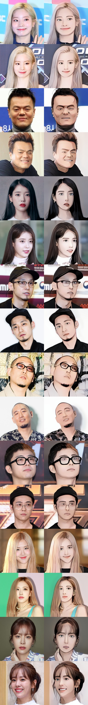

## PyTorch Implementation of [AnimeGANv2](https://github.com/TachibanaYoshino/AnimeGANv2)


**Weight Conversion from the Original Repo (Requires TensorFlow 1.x)**
```
git clone https://github.com/TachibanaYoshino/AnimeGANv2
python convert_weights.py
```

**Inference**
```
python test.py --input_dir [image_folder_path] --device [cpu/cuda]
```


**Results from converted [[Paprika]](https://drive.google.com/file/d/1K_xN32uoQKI8XmNYNLTX5gDn1UnQVe5I/view?usp=sharing) style model**

(input image, original tensorflow result, pytorch result from left to right)

 &nbsp; 
 &nbsp; 
 &nbsp; 

**Note:** Training code not included / Tested on RTX3090 + PyTorch1.7.1 / Results from converted weights slightly different due to the [bilinear upsample issue](https://github.com/pytorch/pytorch/issues/10604)


## Additional Models

**Webtoon Face** [[ckpt]](https://drive.google.com/file/d/10T6F3-_RFOCJn6lMb-6mRmcISuYWJXGc)

<details>
<summary>samples</summary>

Works best on <b>256x256</b> face images. Distilled from [webtoon face model](https://github.com/bryandlee/naver-webtoon-faces/blob/master/README.md#face2webtoon) with L2 + VGG + GAN Loss and CelebA-HQ images. See `test_faces.ipynb` for details.

 &nbsp; 
  
</details>


**Face Portrait v1** [[ckpt]](https://drive.google.com/file/d/1WK5Mdt6mwlcsqCZMHkCUSDJxN1UyFi0-)

<details>
<summary>samples</summary>

Works best on <b>512x512</b> face images. (WIP)
  
[](https://colab.research.google.com/drive/1jCqcKekdtKzW7cxiw_bjbbfLsPh-dEds?usp=sharing)
  


 

  
</details>


